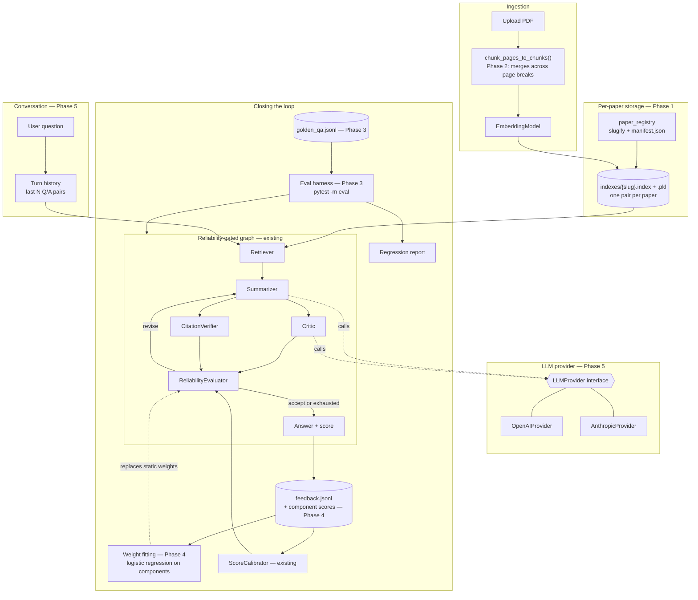

# PaperMind Improvement Roadmap Implementation Plan

> **For agentic workers:** REQUIRED SUB-SKILL: Use superpowers:subagent-driven-development (recommended) or superpowers:executing-plans to implement this plan task-by-task. Steps use checkbox (`- [ ]`) syntax for tracking.

**Goal:** Take PaperMind from "works for one paper in one sitting" to a tool that holds multiple papers, chunks them without losing context at page breaks, and can prove — via a real eval set and evaluator weights fit on actual outcomes — that its confidence score means something.

**Architecture:** Five independent phases, each landing working software on its own: (1) per-paper index storage replacing the single global index file, (2) chunking that survives page boundaries, (3) a golden-question eval harness, (4) evaluator weights fit from labeled data instead of hand-picked constants, (5) a pluggable LLM provider plus multi-turn conversation memory. Phases 3 and 4 depend on Phase 1 (a stable per-paper index is what makes a repeatable golden set possible); the rest are independent and can be sequenced freely.

**Tech Stack:** Python 3.10, Streamlit, FAISS, sentence-transformers, LangGraph `StateGraph`, OpenAI SDK (v3, structured outputs), pytest.

**Spec:** None yet — no `superpowers:brainstorming` pass was run before this plan (the five improvements were identified during a code-reading session, not a design session). This doc carries each phase's rationale inline instead. **Phase 1 below is a full, ready-to-execute task breakdown.** Phases 2–5 are scoped designs, not yet broken into bite-sized tasks — per the writing-plans scope check, a plan covering five independent subsystems should be split, so each of those phases gets its own `superpowers:brainstorming` → spec → plan pass when its turn comes, using the design notes here as the starting brief.

## Global Constraints

- Don't break the existing 43 passing tests or the CI lint gate (`isort --check-only src tests app.py`, `flake8 --max-line-length=120 src tests app.py`).
- No new hard dependencies unless a phase's design explicitly calls for one (state it in `requirements.txt` with a version floor, matching the existing `langgraph>=1.2.0,<2.0.0` / `openai>=3.0.0,<4.0.0` style).
- Follow the existing DI pattern for testability: agents/evaluators take an optional constructor override, default to real construction (see `SummarizerAgent(client=...)`, `ReliabilityEvaluator(calibrator=...)`).
- Windows-first repo (paths, line endings) — avoid POSIX-only path assumptions.

---

## Roadmap overview

| Phase | Improvement | Depends on | Effort | Status |
|---|---|---|---|---|
| 1 | Per-paper index storage | — | S | **Implemented 2026-08-27** |
| 2 | Cross-page chunking (+ extraction-gap detection addendum) | — | S | **Implemented 2026-08-27** |
| 3 | Golden-question eval harness | Phase 1 | M | Scoped, needs its own plan |
| 4 | Evaluator weights fit from data | Phase 1, Phase 3 (to validate) | M | Scoped, needs its own plan |
| 5 | Pluggable LLM provider + conversation memory | — | M | Scoped, needs its own plan |

## Target architecture



Solid arrows are data that flows on every query. Dashed arrows are the two places this roadmap changes *how a decision gets made* rather than just moving data: the LLM calls become provider-agnostic, and the evaluator's weights stop being constants.

---

## Phase 1: Per-paper index storage (fully planned)

### Why this first

Today, `app.py` always saves to the hardcoded path `"paper_index"` (`app.py:109`, `app.py:224`, `app.py:232`), so uploading a second PDF silently overwrites the first paper's index — there is exactly one slot. The saved index binaries (`paper_index.index`, `paper_index.pkl`, 147KB + 86KB) are also currently committed to git (`git ls-files` confirms this), which is generated data that doesn't belong in version control. This phase fixes both: one index per paper, keyed by a stable slug, discoverable from a small manifest — and stops committing the binaries.

### File structure

- **Create:** `src/paper_registry.py` — resolves a `paper_id` to its on-disk index path and tracks known papers in a manifest. One responsibility: naming and remembering, not storage format (that stays `FaissStore`'s job).
- **Create:** `tests/test_paper_registry.py`
- **Modify:** `app.py` — build/save path, and replace the blind "Load saved index" / "Save current index" sidebar buttons with a picker over known papers.
- **Modify:** `.gitignore` — add `indexes/`.
- **One-time repo cleanup:** stop tracking `paper_index.index` / `paper_index.pkl`.

### Task 1: `paper_registry` — slug and path resolution

**Files:**
- Create: `src/paper_registry.py`
- Test: `tests/test_paper_registry.py`

**Interfaces:**
- Produces: `slugify_paper_id(paper_id: str) -> str` (16-char lowercase hex, stable for a given `paper_id`); `index_path_for(paper_id: str, base_dir: str = "indexes") -> str` (creates `base_dir` if missing, returns `os.path.join(base_dir, slug)` — the same kind of path prefix `FaissStore.save`/`.load` already accept).

- [ ] **Step 1: Write the failing tests**

```python
# tests/test_paper_registry.py
import os

from src.paper_registry import index_path_for, slugify_paper_id


def test_slugify_is_stable_for_the_same_paper_id():
    assert slugify_paper_id("paper:foo.pdf") == slugify_paper_id("paper:foo.pdf")


def test_slugify_differs_for_different_paper_ids():
    assert slugify_paper_id("paper:foo.pdf") != slugify_paper_id("paper:bar.pdf")


def test_slugify_is_filesystem_safe():
    slug = slugify_paper_id("paper:weird name / with * chars?.pdf")
    assert all(c.isalnum() for c in slug)


def test_index_path_for_creates_base_dir(tmp_path):
    base_dir = str(tmp_path / "indexes")
    assert not os.path.exists(base_dir)
    path = index_path_for("paper:foo.pdf", base_dir=base_dir)
    assert os.path.isdir(base_dir)
    assert path.startswith(base_dir)


def test_index_path_for_is_stable_across_calls(tmp_path):
    base_dir = str(tmp_path / "indexes")
    first = index_path_for("paper:foo.pdf", base_dir=base_dir)
    second = index_path_for("paper:foo.pdf", base_dir=base_dir)
    assert first == second
```

- [ ] **Step 2: Run tests to verify they fail**

Run: `python -m pytest tests/test_paper_registry.py -v`
Expected: FAIL with `ModuleNotFoundError: No module named 'src.paper_registry'`

- [ ] **Step 3: Write minimal implementation**

```python
# src/paper_registry.py
"""Resolves a paper_id to a stable on-disk index path, and remembers which
papers have been indexed so the UI can offer them back without re-uploading.

One index per paper (see docs/superpowers/plans/2026-08-23-improvement-roadmap.md,
Phase 1) instead of the single global paper_index.index/.pkl this replaces.
"""
import hashlib
import os

DEFAULT_BASE_DIR = "indexes"


def slugify_paper_id(paper_id: str) -> str:
    return hashlib.sha1(paper_id.encode("utf-8")).hexdigest()[:16]


def index_path_for(paper_id: str, base_dir: str = DEFAULT_BASE_DIR) -> str:
    os.makedirs(base_dir, exist_ok=True)
    return os.path.join(base_dir, slugify_paper_id(paper_id))
```

- [ ] **Step 4: Run tests to verify they pass**

Run: `python -m pytest tests/test_paper_registry.py -v`
Expected: PASS (5 tests)

- [ ] **Step 5: Commit**

```bash
git add src/paper_registry.py tests/test_paper_registry.py
git commit -m "Add per-paper index path resolution"
```

### Task 2: manifest — register and list known papers

**Files:**
- Modify: `src/paper_registry.py`
- Test: `tests/test_paper_registry.py`

**Interfaces:**
- Consumes: `DEFAULT_BASE_DIR`, `slugify_paper_id` from Task 1.
- Produces: `register_paper(paper_id: str, display_name: str, base_dir: str = DEFAULT_BASE_DIR) -> None`; `list_registered_papers(base_dir: str = DEFAULT_BASE_DIR) -> list[dict]`, each entry `{"slug": str, "paper_id": str, "display_name": str}`.

- [ ] **Step 1: Write the failing tests**

```python
# append to tests/test_paper_registry.py
from src.paper_registry import list_registered_papers, register_paper


def test_register_and_list_round_trip(tmp_path):
    base_dir = str(tmp_path / "indexes")
    register_paper("paper:foo.pdf", "foo.pdf", base_dir=base_dir)
    papers = list_registered_papers(base_dir=base_dir)
    assert len(papers) == 1
    assert papers[0]["paper_id"] == "paper:foo.pdf"
    assert papers[0]["display_name"] == "foo.pdf"


def test_register_paper_is_idempotent_per_paper_id(tmp_path):
    base_dir = str(tmp_path / "indexes")
    register_paper("paper:foo.pdf", "foo.pdf", base_dir=base_dir)
    register_paper("paper:foo.pdf", "foo (renamed).pdf", base_dir=base_dir)
    papers = list_registered_papers(base_dir=base_dir)
    assert len(papers) == 1
    assert papers[0]["display_name"] == "foo (renamed).pdf"


def test_list_registered_papers_empty_when_nothing_registered(tmp_path):
    assert list_registered_papers(base_dir=str(tmp_path / "indexes")) == []
```

- [ ] **Step 2: Run tests to verify they fail**

Run: `python -m pytest tests/test_paper_registry.py -v`
Expected: FAIL with `ImportError: cannot import name 'register_paper' from 'src.paper_registry'`

- [ ] **Step 3: Write minimal implementation**

```python
# add to src/paper_registry.py
import json
from typing import List

MANIFEST_FILENAME = "manifest.json"


def _manifest_path(base_dir: str) -> str:
    return os.path.join(base_dir, MANIFEST_FILENAME)


def _load_manifest(base_dir: str) -> dict:
    path = _manifest_path(base_dir)
    if not os.path.exists(path):
        return {}
    with open(path, "r", encoding="utf-8") as f:
        try:
            return json.load(f)
        except json.JSONDecodeError:
            return {}


def register_paper(paper_id: str, display_name: str, base_dir: str = DEFAULT_BASE_DIR) -> None:
    os.makedirs(base_dir, exist_ok=True)
    manifest = _load_manifest(base_dir)
    manifest[slugify_paper_id(paper_id)] = {"paper_id": paper_id, "display_name": display_name}
    with open(_manifest_path(base_dir), "w", encoding="utf-8") as f:
        json.dump(manifest, f, indent=2)


def list_registered_papers(base_dir: str = DEFAULT_BASE_DIR) -> List[dict]:
    manifest = _load_manifest(base_dir)
    return [
        {"slug": slug, "paper_id": entry["paper_id"], "display_name": entry["display_name"]}
        for slug, entry in manifest.items()
    ]
```

- [ ] **Step 4: Run tests to verify they pass**

Run: `python -m pytest tests/test_paper_registry.py -v`
Expected: PASS (8 tests)

- [ ] **Step 5: Lint**

Run: `python -m isort --check-only src/paper_registry.py tests/test_paper_registry.py && python -m flake8 --max-line-length=120 src/paper_registry.py tests/test_paper_registry.py`
Expected: no output (clean)

- [ ] **Step 6: Commit**

```bash
git add src/paper_registry.py tests/test_paper_registry.py
git commit -m "Add a manifest so previously indexed papers can be listed and reloaded"
```

### Task 3: wire into `app.py`, retire the global index file

**Files:**
- Modify: `app.py:1-14` (imports), `app.py:87-112` (build+save), `app.py:220-235` (sidebar)
- Modify: `.gitignore`
- Delete from git tracking: `paper_index.index`, `paper_index.pkl`

**Interfaces:**
- Consumes: `index_path_for`, `register_paper`, `list_registered_papers` from Tasks 1–2.

- [ ] **Step 1: Add the import**

In `app.py`, alongside the existing `src.*` imports:

```python
from src.paper_registry import index_path_for, list_registered_papers, register_paper
```

- [ ] **Step 2: Replace the hardcoded save path**

Find (`app.py:107-112`):

```python
            # Save index automatically to disk
            try:
                store.save("paper_index")
                st.info("Index saved to 'paper_index.index' and 'paper_index.pkl'")
            except Exception:
                st.warning("Unable to auto-save index to disk")
```

Replace with:

```python
            # Save index automatically to disk, keyed to this paper
            try:
                index_path = index_path_for(paper_id)
                store.save(index_path)
                register_paper(paper_id, paper_name)
                st.info(f"Index saved for '{paper_name}'")
            except Exception:
                st.warning("Unable to auto-save index to disk")
```

- [ ] **Step 3: Replace the blind load/save sidebar with a picker**

Find (`app.py:220-235`):

```python
        # Index persistence controls
        st.sidebar.header("Index storage")
        if st.sidebar.button("Load saved index"):
            try:
                store = FaissStore.load("paper_index")
                st.session_state['store'] = store
                st.success("Loaded index from 'paper_index'")
            except Exception as e:
                st.error(f"Failed to load index: {e}")

        if st.sidebar.button("Save current index"):
            try:
                st.session_state['store'].save("paper_index")
                st.success("Saved index to 'paper_index'")
            except Exception as e:
                st.error(f"Failed to save index: {e}")
```

Replace with:

```python
        # Index persistence controls
        st.sidebar.header("Previously indexed papers")
        known_papers = list_registered_papers()
        if known_papers:
            options = {p["display_name"]: p["paper_id"] for p in known_papers}
            choice = st.sidebar.selectbox("Load a paper", list(options.keys()))
            if st.sidebar.button("Load"):
                try:
                    store = FaissStore.load(index_path_for(options[choice]))
                    st.session_state['store'] = store
                    st.session_state['paper_id'] = options[choice]
                    st.sidebar.success(f"Loaded '{choice}'")
                except Exception as e:
                    st.sidebar.error(f"Failed to load index: {e}")
        else:
            st.sidebar.caption("No papers indexed yet — upload one above.")
```

(The build step already auto-saves and registers, so a manual "Save current index" button no longer does anything a user needs — it's dropped rather than kept as dead weight.)

- [ ] **Step 4: Update `.gitignore`**

Add:

```
indexes/
```

- [ ] **Step 5: Untrack the old global index binaries**

```bash
git rm --cached paper_index.index paper_index.pkl
```

(This removes them from tracking without deleting the local files, in case anything local still reads them mid-transition; the new manifest-driven flow never touches these paths, so they're safe to delete locally too, at your discretion.)

- [ ] **Step 6: Manual verification**

Run: `streamlit run app.py`
- Upload a PDF, build its index, confirm the sidebar's "Previously indexed papers" list now shows it.
- Upload a **second, different** PDF, build its index.
- Confirm both papers now appear in the sidebar picker, and switching between them via "Load" swaps `st.session_state['store']` without one overwriting the other's saved files on disk (check the `indexes/` directory has two distinct `{slug}.index`/`.pkl` pairs).

- [ ] **Step 7: Run the full test suite and lint**

Run: `python -m pytest -q && python -m isort --check-only src tests app.py && python -m flake8 --max-line-length=120 src tests app.py`
Expected: all existing tests still pass (nothing in this task touches `src/langgraph_agents.py` or `src/evaluator.py`), lint clean.

- [ ] **Step 8: Commit**

```bash
git add app.py .gitignore
git commit -m "Store one FAISS index per paper instead of a single global index"
```

### Self-review (Phase 1)

- **Coverage:** every file in the Phase 1 file structure list has a task touching it. ✓
- **Placeholders:** no "TBD"/"handle errors appropriately" — the one intentionally-vague item (deleting local `paper_index.*` files) is explicitly left as the user's discretion, not an implementation gap. ✓
- **Type/name consistency:** `index_path_for`, `register_paper`, `list_registered_papers` are named identically across Tasks 1–3 and `app.py`. ✓

---

## Phase 2: Cross-page chunking (scoped, not yet a task list)

**Problem:** `chunk_pages_to_chunks()` (`src/ingest.py:32-85`) loops `for page in pages` and resets `cur = ""` at the top of every page. A sentence — or an argument — that straddles a page break is split at the page boundary regardless of where the chunk-size logic would otherwise have cut it, so the tail end of page *N* and the head of page *N+1* never appear in the same chunk even when they're one continuous sentence.

**Design sketch:** concatenate all pages into one text stream up front, but keep a per-character-offset → page-number lookup table (built once from each page's known start offset in the concatenated stream) so `chunk_pages_to_chunks` can still attribute each chunk to a page (or a `{start_page, end_page}` pair, when a chunk spans two) for citations. `split_sentences` and the existing chunk-size/overlap logic stay unchanged — only the "reset at page boundary" behavior goes away. Citation display (`app.py`, `SummarizerAgent`'s `[chunk_id:X page:Y]` header) needs to accept an optional page range instead of a single page.

**Risk to watch:** `CitationVerifierAgent` and the Summarizer's citation header both assume one page per chunk today — a chunk spanning two pages needs those call sites updated in the same change, or citations silently degrade to "page: None" for spanning chunks.

**Suggested next step:** `superpowers:brainstorming` on this specifically — the open question is what a citation for a page-spanning chunk should look like to the end user ("p. 3–4" vs. picking the majority page vs. splitting the chunk at the page boundary anyway but *carrying forward the last sentence of the prior page as context only, not as its own citation-bearing text*). That's a product decision, not just an implementation one.

## Phase 3: Golden-question eval harness (scoped, not yet a task list)

**Problem:** there is no way to know if a change to retrieval, prompts, or the evaluator's weights made answers better or worse, other than re-running the Streamlit app by hand. `tests/` only unit-tests components in isolation with fakes — nothing measures the real pipeline against a paper with known-correct answers.

**Design sketch:**
- A fixture paper (the existing `examples/sample.pdf` is a candidate) with a hand-written `tests/fixtures/golden_qa.jsonl`: `{"question": ..., "expected_citation_pages": [...], "expected_claims": [...]}` — a handful of questions (10–20) whose correct page(s) and key factual claims are known by inspection.
- A harness (`tests/test_eval_golden.py`, or a separate `scripts/run_eval.py` if it needs to call a real LLM and shouldn't run on every `pytest` invocation — mark it `@pytest.mark.eval` and exclude it from the default CI run, since it costs real API calls) that runs `make_orchestrator(...).invoke(...)` per question and checks: did retrieval surface a chunk from an expected page; did the citation verifier's `verified_ratio` clear a floor; is the reliability score's accept/revise/exhausted decision what you'd expect.
- Output: a small report (pass/fail per question, plus the reliability score) — this is what Phase 4's weight-fitting validates against before you'd trust a re-fit weight vector.

**Depends on Phase 1** because a golden set needs a paper whose index doesn't get silently overwritten by whatever the user last uploaded.

**Suggested next step:** decide whether this harness is allowed to make real OpenAI calls (nondeterministic, costs money, tests true end-to-end behavior) or must run entirely against fakes (deterministic, free, but doesn't catch prompt-quality regressions) — that's a `superpowers:brainstorming` question, not an implementation detail.

## Phase 4: Evaluator weights fit from data (scoped, not yet a task list)

**Problem:** `ReliabilityEvaluator.SEMANTIC_WEIGHT/VERIFIER_WEIGHT/CRITIC_WEIGHT/CITATION_WEIGHT` (`src/evaluator.py:35-38`) are constants chosen once. The `ScoreCalibrator` added earlier corrects the *output* of that formula against outcomes, but nothing checks whether 0.40/0.25/0.20/0.15 are even the right proportions — a differently-weighted formula might need far less post-hoc correction in the first place.

**Design sketch:**
- `feedback.jsonl` currently logs only the final blended `confidence` and the `accurate`/`hallucinated` label — not the four component scores that went into it. This phase would extend the feedback record (in `app.py`'s "Accurate"/"Hallucinated" button handlers) to also log `semantic`, `verifier`, `critic_confidence`, `citation_verified_ratio` — the same values `ReliabilityEvaluator.evaluate()` already computes, just not currently returned far enough to reach the feedback dict.
- A fitting script (`scripts/fit_evaluator_weights.py`) reads accumulated records, fits a logistic regression (`label == "accurate"` as the target, the four components as features — `sklearn.linear_model.LogisticRegression` is already present as a transitive dependency of `sentence-transformers` in this environment, but should be added to `requirements.txt` explicitly if this phase lands, not relied on implicitly), and writes the fit weights to a small `evaluator_weights.json` that `ReliabilityEvaluator` loads instead of the hardcoded class constants.
- Needs materially more labeled data than exists today (`feedback.jsonl` has 1 record as of this writing) — this phase is really "build the mechanism now, let it activate once there's enough data," the same shape as the `ScoreCalibrator`'s `MIN_SAMPLES` gate.

**Depends on Phase 1** (stable per-paper testing) **and benefits from Phase 3** (an eval harness to confirm a re-fit weight vector doesn't quietly make things worse on the golden set before it ships).

## Phase 5: Pluggable LLM provider + conversation memory (scoped, not yet a task list)

**Problem:** two independent gaps bundled under one theme. `src/llm_client.py` and the `client.chat.completions.parse(..., response_format=PydanticModel)` calls in `SummarizerAgent`/`CriticAgent` are OpenAI-specific — there's no fallback if OpenAI is down and no way to compare providers on hallucination rate. Separately, every question is independent: `GraphState` in `src/langgraph_agents.py` has no memory of prior turns, so "what about section 4?" as a follow-up gets no context from the previous answer.

**Design sketch (provider):**
- Introduce `src/llm_provider.py` with a small `LLMProvider` protocol: one method, e.g. `parse(system: str, user: str, response_format: Type[BaseModel]) -> BaseModel | None` (returns `None` on failure, matching the existing "fall back to heuristic" contract `SummarizerAgent`/`CriticAgent` already rely on).
- `OpenAIProvider` wraps today's `get_openai_client()` + `.chat.completions.parse(...)` call. `AnthropicProvider` would use the `anthropic` SDK's tool-use for structured output (Anthropic has no native `response_format` — the provider translates the Pydantic schema into a tool definition and extracts the tool-call arguments).
- `SummarizerAgent`/`CriticAgent` take a `provider` instead of a raw `client`; existing tests' `FakeClient`/`RaisingClient` fixtures become fakes of `LLMProvider` instead — a small, mechanical test update.

**Design sketch (memory):**
- Add `history: List[dict]` — wait, `GraphState.history` already exists but holds *revision* attempts within one question, not prior questions. This needs a separate `conversation: List[dict]` field (`{"query": ..., "summary": ...}` per past turn) threaded in from `st.session_state` in `app.py`, appended to the Summarizer's prompt context (similar to how `critique_feedback`/`previous_summary` already get woven in for the revise loop) so a follow-up question can reference "the previous answer."
- Open question for brainstorming: does a follow-up question re-retrieve from scratch (simple, may miss context the follow-up implicitly depends on) or does retrieval also consider the conversation history (more relevant, more complex ranking)?

**No dependency on other phases** — could be picked up any time, and the two halves (provider, memory) are independent enough to split into two separate plans if desired.

---

## Future enhancements (beyond this roadmap)

Raised 2026-08-27 while brainstorming Phase 3, after stepping back to ask what problem PaperMind actually solves that generic chat tools (ChatGPT, Claude, NotebookLM, Perplexity, "chat with your PDF" products) don't already solve well. Single-document Q&A with citations is commoditized; these three directions push toward genuinely underserved territory, and all three reuse what's already built (Phase 1's per-paper storage, the reliability pipeline, `CitationVerifierAgent`) rather than starting over. None are scoped or planned yet — each needs its own `superpowers:brainstorming` pass when picked up.

1. **Multi-paper synthesis.** Query across *all* indexed papers at once instead of one at a time — answers cite which paper *and* page per claim, each mechanically verified. Solves real literature-review pain (most tools degrade fast past one document). Smallest step from the current architecture, since Phase 1 already gives a library of separately-indexed papers.
2. **Contradiction detector.** Given a topic, deliberately retrieve across multiple papers and flag where they disagree (e.g. "Paper A claims 94% accuracy, Paper B claims 81% for a similar method"), with citations on both sides. More novel, a richer multi-agent reasoning problem, narrower use case than (1).
3. **Citation-checker for your own writing.** Flip the direction: paste a paragraph you're drafting, and PaperMind checks each claim against the papers you say support it — the same verification mechanism `CitationVerifierAgent` already does, pointed at *your* citations instead of the LLM's. Solves a different, concrete pain (citation errors in academic writing) but is a bigger pivot in what the tool is (a writing-checking tool, not a paper-reading tool).

**Why citation verification matters more here than for one paper:** a human can eyeball one paper's citations manually in ten minutes; nobody manually checks fifty papers' worth. At multi-paper scale, the mechanical verification step stops being a nice-to-have and becomes the actual value proposition.

---

## Execution Handoff

Only Phase 1 is ready to execute as bite-sized tasks. Two options for it:

**1. Subagent-Driven (recommended)** — I dispatch a fresh subagent per task, review between tasks, fast iteration.

**2. Inline Execution** — Execute tasks in this session using `executing-plans`, batch execution with checkpoints.

For Phases 2–5, the recommended next step is a `superpowers:brainstorming` session per phase (they each have at least one open product/design question called out above) before writing that phase's own plan.

Which approach for Phase 1?
